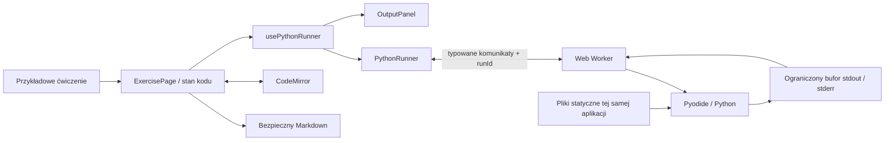

# Architektura — Milestone 1

Status: lokalny playground jednego ćwiczenia. Punktem odniesienia jest [product-spec.md](product-spec.md), szczególnie sekcje 35, 45 i 46.

## Przepływ

Serwer dostarcza wyłącznie pliki statyczne. Kod ucznia nie jest wysyłany do serwera i nie jest na nim wykonywany.

## Podział odpowiedzialności

- `ExercisePage` przechowuje kod niezależnie od workera. Przekazuje jego kopię do wykonania. Edycja podczas działania programu nie zmienia już uruchomionej kopii.
- `CodeEditor` opakowuje CodeMirror bez logiki wykonania. Cięższa część edytora jest ładowana osobnym modułem, aby początkowy pakiet interfejsu pozostał mniejszy.
- `usePythonRunner` wiąże zdarzenia runnera ze stanem React i zwalnia zasoby po odmontowaniu.
- `PythonRunner` obsługuje inicjalizację, jeden aktywny program, timery, identyfikatory wykonań, Stop, restart i awarie. Nie importuje Pyodide do głównego wątku.
- `python.worker.ts` ładuje Pyodide, uruchamia wrapper i wysyła strukturalne wyniki.
- `execute.py` uruchamia kod pod nazwą `main.py`, w nowym słowniku globalnym, zachowuje traceback ucznia oraz wyklucza z niego własną ramkę `exec`.
- `OutputBuffer` ogranicza ilość danych oraz częstość komunikatów. `OutputPanel` renderuje tekst jako zwykły tekst React.

## Protokół i cykl życia

Polecenia do workera:

- `initialize(indexURL)`;
- `run(runId, code, inputUnavailableMessage)`.

Odpowiedzi:

- `ready`;
- `output(runId, stream, text)`;
- `output-truncated(runId)`;
- `finished(runId, success, durationMs, errorType?, errorMessage?, traceback?)`;
- `fatal` dla problemów infrastrukturalnych.

`PythonRunner.run()` zwraca `Promise<ExecutionResult>`, zawierający wynik, stdout, stderr, czas i typ zakończenia: `success`, `python-error`, `stopped`, `timeout` lub `runtime-error`. Obietnica kończy się także przy Stop i awarii. Żądanie równoległego wykonania jest odrzucane; UI dodatkowo blokuje przycisk oraz wielokrotne skróty.

Pierwszy Run inicjalizuje worker. Zwykły sukces lub błąd Pythona pozostawia go gotowego do ponownego użycia. Stop, timeout i błąd infrastruktury kończą worker. Następny Run tworzy nowy. `restart()` wykonuje reset leniwy, bez natychmiastowego pobierania interpretera.

Identyfikator wykonania oraz porównanie instancji workera zapobiegają przyjęciu wiadomości z poprzedniego uruchomienia albo już zakończonego workera.

## Limity i przechwytywanie wyjścia

- Inicjalizacja: 60 sekund, obejmujące pobranie i uruchomienie interpretera.
- Program: 10 sekund, liczonych od wysłania kodu do gotowego workera.
- Limity egzekwuje główny wątek, więc nieskończona pętla Pythona nie blokuje timera.
- Stop korzysta z `worker.terminate()`; nie wymaga SharedArrayBuffer ani współpracy programu ucznia.
- Stdout i stderr: łącznie do 50 000 jednostek tekstu JavaScript, z komunikatem o skróceniu. Interfejs upraszcza tę jednostkę do „znaków”.
- Worker dekoduje UTF-8 strumieniowo, zachowuje końce linii i częściowe linie. Wrapper opróżnia strumienie po wykonaniu.
- Wiadomości wyjścia są łączone w paczki z odstępem co najmniej około 40 ms podczas wypisywania oraz opróżniane na końcu wykonania. To sprawdzenie odbywa się w obsłudze zapisu, a nie w timerze workera blokowanym przez Python.
- Traceback jest ograniczony do 12 000 znaków, a komunikat wyjątku do 4 000.

Twarde zakończenie może zgubić końcówkę jeszcze niewysłanego stdout. Zapisany w React kod pozostaje bez zmian. Limit czasu nie stanowi twardego limitu pamięci procesu przeglądarki.

## Powtarzalność wykonań

Każde uruchomienie dostaje nowy słownik zmiennych oraz kopię słownika builtins. Zwykłe zmienne i funkcje ucznia nie przechodzą do kolejnego wykonania. Interpreter, cache importów i jego wirtualny system plików są współdzielone między zwykłymi uruchomieniami w tej samej karcie. Ten kompromis skraca oczekiwanie na kolejne uruchomienie. Pełne odtworzenie workera usuwa również ten stan.

`input()` jest zastąpione funkcją zgłaszającą `NotImplementedError` z przetłumaczoną wskazówką. Dodatkowo standardowe wejście interpretera zwraca EOF, co zapobiega domyślnemu promptowi. Terminalowe wejście odroczono poza M1; nie używamy blokującego okna przeglądarki ani automatycznego przepisywania kodu ucznia.

## Dostarczanie runtime’u

Pyodide 314.0.7 jest przypięte w zależnościach. Skrypt `scripts/prepare-pyodide.mjs` kopiuje loader, moduł Emscripten, WASM, bibliotekę standardową i manifest z tego samego pakietu do `public/pyodide/`. `dev` i `build` wykonują go automatycznie.

Worker jest modułem ES. Import loadera jest dynamiczny i pomijany przez przekształcenia Vite, aby zachować wewnętrzne ścieżki plików Emscripten. Sam worker jest bundlowany przez Vite. Nie używamy pobierania pakietów na podstawie importów ucznia ani CDN w czasie działania.

Wersja i obsługa workerów: [dokumentacja Pyodide](https://pyodide.org/en/stable/usage/webworker.html). Obsługa strumieni: [dokumentacja standardowego wejścia i wyjścia](https://pyodide.org/en/stable/usage/streams.html).

## Bezpieczeństwo i prywatność

M1 nie ma sesji, danych innych uczniów, rozwiązań ani sekretów. Nie dodano analityki, zewnętrznych fontów ani innych żądań do usług trzecich podczas zwykłego uruchomienia ćwiczenia.

Worker oddziela wykonanie od UI, ale nie jest pełnym sandboxem dla wrogiego kodu. Pyodide ma most do JavaScript, a worker tej samej domeny może mieć uprawnienia sieciowe przeglądarki. Protokół i telemetryka pochodzące z runtime’u są niezaufane. Przed dodaniem uwierzytelnienia trzeba ponownie ocenić izolację runtime’u, dostęp do domeny aplikacji i kontekst sesji. Nigdy nie wolno przekazywać mu sekretów ani traktować klienta jako źródła uprawnień.

Markdown przechodzi przez `react-markdown`, GFM i `rehype-sanitize`; surowy HTML jest pomijany. Wyjście programu nie jest wstawiane jako HTML. Błędy infrastruktury wyświetlane uczniowi nie zawierają stosu JavaScript ani adresów wewnętrznych. Worker loguje diagnostykę awarii w konsoli deweloperskiej bez celowego logowania źródła programu.

## Interfejs i dostępność

Interfejs używa ciemnej palety granatów i szarości, z jasnym tekstem oraz dopasowanym motywem CodeMirror. Kolory powierzchni i tekstu są określone zmiennymi CSS.

Na ekranie 1366×768 instrukcja znajduje się po lewej, edytor pośrodku, a konsola po prawej. Panele wykorzystują dostępną wysokość ekranu; długie instrukcje, kod i wyjście przewijają się wewnątrz paneli. Zwijanie instrukcji pozostawia wąski pasek, a zwolnioną szerokość przejmuje edytor. Przycisk działa klawiaturą i udostępnia `aria-expanded` oraz `aria-controls`; zwinięcie nie odmontowuje edytora ani nie resetuje kodu.

Przy szerokości do 1100 px instrukcja zajmuje górny rząd nad edytorem i konsolą. Do 720 px wszystkie panele układają się pionowo. Edytor ma font 16 px, widoczny fokus, nazwę dostępną i instrukcję wyjścia klawiaturą. Statusy mają tekst, a nie tylko kolor. Komunikat zakończenia używa `role="status"`; całe stdout nie jest agresywnie odczytywane przy każdej zmianie.

UI korzysta ze słowników `i18n/pl.ts` i `i18n/en.ts`; treść lekcji stanowi oddzielne dane. Informacja o przechowywaniu kodu wyłącznie do zamknięcia lub odświeżenia karty jest widoczna pod ćwiczeniem.

## Kolejne milestone’y — granice modułów

Te mechanizmy nie są zaimplementowane w M1:

- **M2 / Turtle:** nowe komunikaty rysowania między workerem a osobnym rendererem. Edytor i konsola zachowują obecne role.
- **M3–M5 / dane:** Supabase Auth i RLS, dane lekcji oraz trwałe `student_work`. Uprawnienia muszą być sprawdzane w bazie lub na serwerze. Rozwiązania wymagają osobnej chronionej reprezentacji; samo RLS nie ukrywa kolumn w dostępnych wierszach.
- **M6–M7 / realtime:** PostgreSQL pozostaje źródłem zapisanego kodu, a prywatny Broadcast przenosi tylko aktualny widok. Awaria realtime nie może blokować runnera ani edytora. Widok nauczyciela pozostanie tylko do odczytu.

Nie utworzono pustych modułów bazy, routingu ani realtime. Dokumentacja ich faktycznej implementacji powstanie wraz z odpowiednimi milestone’ami.
