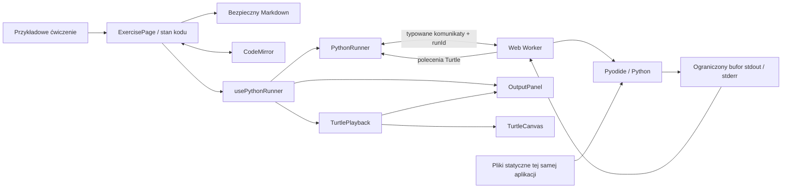
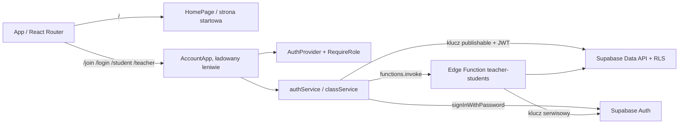

# Architektura — M1–M3 i kroki A–B MVP

Status: playground konsolowy i Turtle, konta i klasy, lekcje z Markdown, trwała praca ucznia oraz dashboard i podgląd kodu nauczyciela. Szczegóły Turtle: [turtle.md](turtle.md). Baza danych i RLS: [database.md](database.md). Kolejność dalszych prac określa [mvp-plan.md](mvp-plan.md).

## Przepływ

Serwer aplikacji dostarcza pliki statyczne. Python wykonuje się w przeglądarce. Kod przypisanych ćwiczeń i ostatni wynik uruchomienia są zapisywane w Supabase. Ćwiczenia wymagają logowania.

## Konta i klasy (Milestone 3)

- `/` to strona startowa z wyborem logowania ucznia lub nauczyciela. Pozostałe ścieżki obsługuje `AccountApp`, ładowany leniwie. Publiczny playground został usunięty z aplikacji; izolowany ekran testowy w `tests/fixtures/` nie trafia do buildu produkcyjnego.
- `/join` to logowanie ucznia (kod klasy, nazwa użytkownika, hasło), `/login` — nauczyciela (e-mail i hasło), `/student` — klasy i przypisane lekcje, `/student/exercises/:id` — ćwiczenie z autosave, `/teacher` i `/teacher/classes/:id` — klasy nauczyciela, uczniowie, przypisania, tworzenie kont i reset haseł.
- `AuthProvider` śledzi sesję Supabase i wczytuje profil z bazy. Rola z profilu służy tylko nawigacji (`RequireRole`). O dostępie decydują RLS, uprawnienia kolumnowe i Edge Function.
- Zapytania kont i klas są w `authService` i `classService`; treści w `lessonService`, przypisania w `LessonAssignments`, praca ucznia w `useStudentWork`. Uprawnienia wszystkich żądań egzekwuje RLS.
- `supabase/functions/teacher-students` tworzy konta uczniów i resetuje hasła, bo wymaga to klucza serwisowego. Logika (`handler.ts`) nie zależy od Deno i ma testy jednostkowe. `index.ts` tylko podłącza Supabase.
- Rejestracja publiczna jest wyłączona (`supabase/config.toml`). Nauczyciel powstaje z seedu albo przez `pnpm teacher:create`, uczeń — przez nauczyciela.

Model danych, adres techniczny ucznia i polityki RLS: [database.md](database.md).

## Podział odpowiedzialności

- `ExercisePage` przyjmuje ćwiczenie, kod, nawigację i status zapisu. `PlaygroundPage` przechowuje lokalne kopie przykładów, a `StudentExercisePage` ładuje przypisane treści i `useStudentWork`. `SampleExercisePicker` obsługuje oba przypadki. Dla `python-turtle` strona pokazuje rysunek. Edycja podczas działania programu nie zmienia uruchomionej kopii.
- `WorkAutosaver` serializuje żądania, łączy zmiany kodu i ostatniego wyniku oraz ponawia nieudane zapisy. Debounce to 1,5 s; uruchomienie i nawigacja czekają na zapis. Ukrycie/opuszczenie strony wywołuje flush. Małe żądania PATCH używają `fetch` z `keepalive` i JWT ucznia; brak kopii localStorage oznacza, że zapis przy zamykaniu karty podczas awarii jest best effort.
- `scripts/sync-content.mjs` waliduje Markdown i upsertuje po slugach kluczem serwisowym. Bloki `python solution` są usuwane przed wysyłką, a rzeczywisty kurs pozostaje poza publicznym repozytorium.
- `TeacherLivePage` pod `/teacher/classes/:id/live` pokazuje tabelę i podgląd CodeMirror (`readOnly` oraz `editable: false`, bez wywołań zapisu i uruchomienia). `useLiveClass` współdzieli jedną subskrypcję Postgres Changes między obiema częściami. Potwierdzona gotowość subskrypcji i udany snapshot warunkują „Na żywo”; rozłączenie zachowuje ostatnie dane. Snapshoty są pobierane kolejno, zdarzenie podczas pobierania wymusza kolejne odczytanie, a reconnect uzupełnia pominięte zmiany. `liveWorkService` czyta przez istniejące RLS i wylicza bieżące ćwiczenie, ostatnie uruchomienie oraz aktywność aktualizowaną co 5 s.
- `CodeEditor` opakowuje CodeMirror bez logiki wykonania. Cięższa część edytora jest ładowana osobnym modułem, aby początkowy pakiet interfejsu pozostał mniejszy.
- `usePythonRunner` wiąże zdarzenia runnera ze stanem React i zwalnia zasoby po odmontowaniu. Wyjście, polecenia Turtle i wynik przechodzą przez `TurtlePlayback`, który synchronizuje konsolę z animacją. W ćwiczeniach konsolowych wyjście pojawia się od razu.
- `PythonRunner` obsługuje inicjalizację, jeden aktywny program, timery, identyfikatory wykonań, Stop, restart i awarie. Nie importuje Pyodide do głównego wątku.
- `python.worker.ts` ładuje Pyodide, uruchamia wrapper i wysyła strukturalne wyniki.
- `execute.py` uruchamia kod pod nazwą `main.py`, w nowym słowniku globalnym, zachowuje traceback ucznia oraz wyklucza z niego własną ramkę `exec`.
- `OutputBuffer` ogranicza ilość danych oraz częstość komunikatów. `OutputPanel` renderuje tekst jako zwykły tekst React.
- `turtle.py`, `turtleBridge.ts`, `TurtleEngine`, `renderTurtle` i `TurtleCanvas` tworzą warstwę Turtle: Python emituje polecenia, worker je waliduje, silnik liczy stan, a canvas tylko rysuje. Opis w [turtle.md](turtle.md).

## Protokół i cykl życia

Polecenia do workera:

- `initialize(indexURL)`;
- `run(runId, code, inputUnavailableMessage, turtle)`.

Odpowiedzi:

- `ready`;
- `output(runId, stream, text, turtleIndex?)` — `turtleIndex` to liczba poleceń Turtle wydanych przed tekstem;
- `output-truncated(runId, turtleIndex?)`;
- `turtle(runId, commands, truncated)` — zwalidowana paczka poleceń rysowania;
- `finished(runId, success, durationMs, errorType?, errorMessage?, traceback?)`;
- `fatal` dla problemów infrastrukturalnych.

`PythonRunner.run()` zwraca `Promise<ExecutionResult>`, zawierający wynik, stdout, stderr, czas i typ zakończenia: `success`, `python-error`, `stopped`, `timeout` lub `runtime-error`. Obietnica kończy się także przy Stop i awarii. Żądanie równoległego wykonania jest odrzucane; UI dodatkowo blokuje przycisk oraz wielokrotne skróty.

Pierwszy Run inicjalizuje worker. Zwykły sukces lub błąd Pythona pozostawia go gotowego do ponownego użycia. Stop, timeout i błąd infrastruktury kończą worker. Następny Run tworzy nowy. `restart()` wykonuje reset leniwy, bez natychmiastowego pobierania interpretera.

Identyfikator wykonania oraz porównanie instancji workera zapobiegają przyjęciu wiadomości z poprzedniego uruchomienia albo już zakończonego workera.

## Limity i przechwytywanie wyjścia

- Inicjalizacja: 60 sekund, obejmujące pobranie i uruchomienie interpretera.
- Program: 10 sekund, liczonych od wysłania kodu do gotowego workera.
- Limity egzekwuje główny wątek, więc nieskończona pętla Pythona nie blokuje timera.
- Stop korzysta z `worker.terminate()`; nie wymaga SharedArrayBuffer ani współpracy programu ucznia.
- Stdout i stderr: łącznie do 50 000 jednostek tekstu JavaScript, z komunikatem o skróceniu. Interfejs upraszcza tę jednostkę do „znaków”.
- Worker dekoduje UTF-8 strumieniowo, zachowuje końce linii i częściowe linie. Wrapper opróżnia strumienie po wykonaniu.
- Wiadomości wyjścia są łączone w paczki z odstępem co najmniej około 40 ms podczas wypisywania oraz opróżniane na końcu wykonania. To sprawdzenie odbywa się w obsłudze zapisu, a nie w timerze workera blokowanym przez Python.
- Traceback jest ograniczony do 12 000 znaków, a komunikat wyjątku do 4 000.
- Polecenia Turtle: do 50 000 na uruchomienie, w paczkach co 500 poleceń lub około 40 ms. Przed policzeniem każdego polecenia worker opróżnia bufor wyjścia, więc przy przeplataniu `print()` i ruchów wiadomości wyjścia są częstsze.

Twarde zakończenie może zgubić końcówkę jeszcze niewysłanego stdout. Zapisany w React kod pozostaje bez zmian. Limit czasu nie stanowi twardego limitu pamięci procesu przeglądarki.

## Powtarzalność wykonań

Każde uruchomienie dostaje nowy słownik zmiennych oraz kopię słownika builtins. Moduł `turtle` jest tworzony od nowa przy każdym uruchomieniu ćwiczenia Turtle i usuwany z `sys.modules` w pozostałych. Zwykłe zmienne i funkcje ucznia nie przechodzą do kolejnego wykonania. Interpreter, cache importów i jego wirtualny system plików są współdzielone między zwykłymi uruchomieniami w tej samej karcie. Ten kompromis skraca oczekiwanie na kolejne uruchomienie. Pełne odtworzenie workera usuwa również ten stan.

`input()` jest zastąpione funkcją zgłaszającą `NotImplementedError` z przetłumaczoną wskazówką. Dodatkowo standardowe wejście interpretera zwraca EOF, co zapobiega domyślnemu promptowi. Terminalowe wejście odroczono poza M1; nie używamy blokującego okna przeglądarki ani automatycznego przepisywania kodu ucznia.

## Dostarczanie runtime’u

Pyodide 314.0.7 jest przypięte w zależnościach. Skrypt `scripts/prepare-pyodide.mjs` kopiuje loader, moduł Emscripten, WASM, bibliotekę standardową i manifest z tego samego pakietu do `public/pyodide/`. `dev` i `build` wykonują go automatycznie.

Worker jest modułem ES. Import loadera jest dynamiczny i pomijany przez przekształcenia Vite, aby zachować wewnętrzne ścieżki plików Emscripten. Sam worker jest bundlowany przez Vite. Nie używamy pobierania pakietów na podstawie importów ucznia ani CDN w czasie działania.

Wersja i obsługa workerów: [dokumentacja Pyodide](https://pyodide.org/en/stable/usage/webworker.html). Obsługa strumieni: [dokumentacja standardowego wejścia i wyjścia](https://pyodide.org/en/stable/usage/streams.html).

## Bezpieczeństwo i prywatność

Nie dodano analityki, zewnętrznych fontów ani innych żądań do usług trzecich. Przeglądarka łączy się tylko z serwerem aplikacji i z projektem Supabase.

Konta (M3):

- Przeglądarka zna tylko URL projektu i klucz publishable. Klucz serwisowy istnieje wyłącznie w Edge Function (wstrzykuje go Supabase) i w powłoce administratora uruchamiającego `pnpm teacher:create`.
- Rola pochodzi z `app_metadata`, którego użytkownik nie może zmienić. Profil i rola są w bazie, a frontend ich nie ustala.
- Uczeń widzi tylko własny profil, swoje klasy i swoje członkostwa. Nauczyciel widzi tylko swoje klasy i swoich uczniów, a do klasy może dodać tylko ucznia, którego sam utworzył. Testy: `tests/db/permissions.test.ts`.
- Logowanie ucznia nie zdradza, czy kod klasy lub nazwa użytkownika istnieją. Limit prób logowania egzekwuje Supabase Auth: `sign_in_sign_ups` w `config.toml`, podniesiony do 300 na 5 minut na IP, bo cała klasa loguje się zza jednego adresu szkolnego. Na hostowanym Supabase trzeba ustawić to samo w panelu.
- Hasła przechowuje Supabase Auth (bcrypt). Wygenerowane hasło ucznia pojawia się w UI nauczyciela tylko raz. Ani hasła, ani tokeny nie są logowane.
- Sesja jest zapisywana w `localStorage` przeglądarki. Na wspólnych komputerach szkolnych uczeń powinien się wylogować; przycisk „Wyloguj się” jest stale widoczny.

Worker oddziela wykonanie od UI, ale nie jest pełnym sandboxem dla wrogiego kodu. Pyodide ma most do JavaScript, a worker tej samej domeny może mieć uprawnienia sieciowe przeglądarki. Protokół i telemetryka pochodzące z runtime’u są niezaufane. Worker nie dostaje sesji ani tokenów. Sesja Supabase leży jednak w `localStorage` tej samej domeny, a kod Pythona ucznia ma przez Pyodide dostęp do API przeglądarki workera (nie do `localStorage`). Uczeń wykonuje własny kod we własnej sesji, więc może zrobić tylko to, na co pozwala mu RLS. Nigdy nie wolno przekazywać runtime’owi sekretów ani traktować klienta jako źródła uprawnień.

Markdown przechodzi przez `react-markdown`, GFM i `rehype-sanitize`; surowy HTML jest pomijany. Wyjście programu nie jest wstawiane jako HTML. Błędy infrastruktury wyświetlane uczniowi nie zawierają stosu JavaScript ani adresów wewnętrznych. Worker loguje diagnostykę awarii w konsoli deweloperskiej bez celowego logowania źródła programu.

## Interfejs i dostępność

Interfejs używa ciemnej palety granatów i szarości, z jasnym tekstem oraz dopasowanym motywem CodeMirror. Kolory powierzchni i tekstu są określone zmiennymi CSS.

Na ekranie 1366×768 instrukcja znajduje się po lewej, edytor pośrodku, a konsola po prawej. Panele wykorzystują dostępną wysokość ekranu; długie instrukcje, kod i wyjście przewijają się wewnątrz paneli. Zwijanie instrukcji pozostawia wąski pasek, a zwolnioną szerokość przejmuje edytor. Przycisk działa klawiaturą i udostępnia `aria-expanded` oraz `aria-controls`; zwinięcie nie odmontowuje edytora ani nie resetuje kodu.

Między edytorem a prawą kolumną jest uchwyt `PanelResizer` (`role="separator"`) do zmiany szerokości. Szerokość prawej kolumny trafia do zmiennej CSS `--output-width`, a edytor zajmuje resztę miejsca (`1fr`). Limity: kolumna ma co najmniej 260 px, edytor co najmniej 320 px, a CSS ogranicza kolumnę do 60% siatki, także po zmniejszeniu okna. Rozmiar canvasu żółwia zależy od jednostek kontenera (`cqh`): rysunek rośnie z szerokością kolumny, a pod nim zostaje miejsce na konsolę. Szerokość jest pamiętana do odświeżenia karty i nie zmienia się przy przełączaniu ćwiczeń.

Przy szerokości do 1100 px instrukcja zajmuje górny rząd nad edytorem i konsolą. Do 720 px wszystkie panele układają się pionowo. Edytor ma font 16 px, widoczny fokus, nazwę dostępną i instrukcję wyjścia klawiaturą. Statusy mają tekst, a nie tylko kolor. Komunikat zakończenia używa `role="status"`; całe stdout nie jest agresywnie odczytywane przy każdej zmianie.

UI korzysta z polskich etykiet `i18n/pl.ts`; treść lekcji stanowi oddzielne dane. Przełącznik języka został usunięty. Informacja o użytkowniku i wylogowanie są w głównym nagłówku, bez dodatkowego paska. Playground informuje o kodzie w pamięci karty; ćwiczenia z konta pokazują status automatycznego zapisu.

## Kolejne milestone’y — granice modułów

Te mechanizmy nie są jeszcze zaimplementowane:

- **Krok C:** GitHub Pages i hostowany Supabase.

Broadcast, Presence, rozwiązania, historia wykonań i edytor treści w aplikacji pozostają poza MVP zgodnie z planem.
