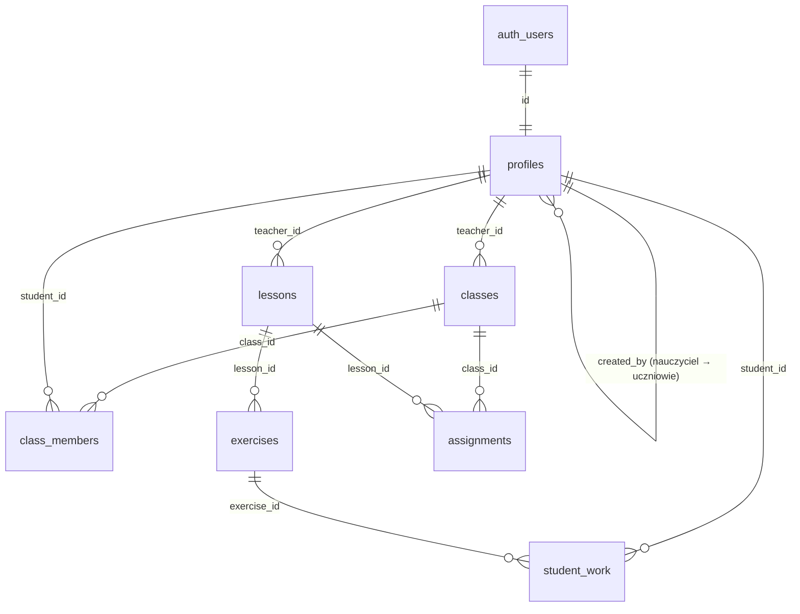

# Baza danych — M3 i kroki A–B MVP

PostgreSQL w Supabase. Schemat tworzą migracje w `supabase/migrations/`, a dane deweloperskie pochodzą z `supabase/seed.sql`. Treści lekcji importuje `pnpm content:sync <dir>`. MVP przechowuje ostatni wynik uruchomienia w `student_work`; historia `execution_events` pozostaje poza MVP.

## Tabele



### `profiles`

Jeden wiersz na konto z rolą w klasie. Tworzy go wyzwalacz `on_auth_user_created` na `auth.users` na podstawie `app_metadata`, które może ustawić tylko klucz serwisowy: Edge Function, seed lub `pnpm teacher:create`.

| Kolumna | Opis |
| --- | --- |
| `id` | = `auth.users.id`, usuwane kaskadowo z kontem |
| `role` | `teacher` lub `student` (enum `user_role`) |
| `display_name` | 1–60 znaków, bez spacji na brzegach |
| `username` | tylko uczniowie: `^[a-z0-9][a-z0-9_-]{1,28}[a-z0-9]$`, unikalna w obrębie nauczyciela |
| `created_by` | tylko uczniowie: nauczyciel, który utworzył konto i nim zarządza |
| `created_at`, `updated_at` | `updated_at` ustawia wyzwalacz |

Ograniczenia: uczeń musi mieć `username` i `created_by`, nauczyciel nie ma żadnego z nich. Wyzwalacz `profiles_check` blokuje zmianę `role`, `username` i `created_by` oraz wymaga, żeby `created_by` wskazywał nauczyciela.

### `classes`

| Kolumna | Opis |
| --- | --- |
| `id` | UUID |
| `teacher_id` | domyślnie `auth.uid()` |
| `name` | 1–80 znaków |
| `join_code` | unikalny; domyślnie 8 znaków z alfabetu bez I, O, 0 i 1 (`private.generate_join_code()`) |
| `created_at` | |

### `class_members`

`(class_id, student_id)` jest unikalne. Wyzwalacz `class_members_check` pozwala dodać do klasy tylko ucznia utworzonego przez nauczyciela tej klasy. Bez tego nauczyciel mógłby „przejąć” dostęp do uczniów innego nauczyciela.

## Treści i praca ucznia (krok A)

- `lessons`: UUID, właściciel `teacher_id`, `slug`, `title`, `position`. Slug jest unikalny dla nauczyciela.
- `exercises`: UUID, `lesson_id`, slug unikalny w lekcji, tytuł, kolejność, instrukcja Markdown, kod początkowy i runtime (`python-console` / `python-turtle`).
- `assignments`: klucz `(class_id, lesson_id)`. Wyzwalacz wymaga tego samego nauczyciela klasy i lekcji.
- `student_work`: klucz `(student_id, exercise_id)`, kod, status `not_started` / `in_progress`, `last_edited_at` i pola `last_run_at`, `last_run_success`, `last_error_type`, `last_error_summary`. Czas edycji ustawia serwer przy utworzeniu lub zmianie kodu; zapis wyniku nie udaje nowej edycji. Tożsamość istniejącej pracy jest niezmienna.

Przeglądarka nie zapisuje treści lekcji i ćwiczeń — robi to importer z kluczem serwisowym. Nie ma kolumn ani tabel z rozwiązaniami. Import aktualizuje treści po slugach, nie nadpisuje pracy ucznia. `student_work` jest w publikacji `supabase_realtime`, przygotowanej pod krok B.

## Logowanie ucznia bez e-maila

Supabase Auth wymaga adresu, więc każdy uczeń ma ukryty adres techniczny:

```text
<username>.<teacher_id bez myślników>@students.invalid
```

Tworzy go `private.student_auth_email()` w SQL. To samo robi `studentAuthEmail()` w `supabase/functions/teacher-students/handler.ts`. Wyzwalacz odrzuca konto ucznia z innym adresem, więc obie implementacje nie mogą się rozjechać po cichu. Domena `.invalid` jest zarezerwowana (RFC 2606); żadna poczta na nią nie wychodzi.

Przebieg na `/join`:

1. Przeglądarka wywołuje `public.student_login_email(kod_klasy, nazwa)`, dostępne dla `anon`. Funkcja zwraca adres techniczny ucznia, jeśli należy on do klasy o tym kodzie. W przeciwnym razie zwraca adres, który nie istnieje. Odpowiedź wygląda tak samo, więc nie ujawnia, czy kod klasy lub nazwa istnieją.
2. `signInWithPassword(adres, hasło)` w Supabase Auth sprawdza hasło (bcrypt) i stosuje limit prób.
3. Uczeń nigdy nie widzi adresu technicznego.

Hasła uczniów generuje Edge Function `teacher-students`: 8 znaków `a–z` i `2–9` bez łatwych do pomylenia (około 40 bitów), losowanych przez `crypto.getRandomValues`. Hasło jest pokazywane nauczycielowi raz i nie jest nigdzie zapisywane jawnie. Reset ustawia nowe hasło i wywołuje `public.revoke_user_sessions()`, dostępne tylko dla `service_role`. Funkcja usuwa sesje ucznia razem z tokenami odświeżania. Wydany token JWT może być jeszcze kryptograficznie ważny, ale kontrola sesji w RLS odbiera mu dostęp do danych aplikacji.

## Jedna sesja konta

Po poprawnym logowaniu `public.claim_account_session()` rejestruje sesję w `private.active_sessions` i usuwa wcześniejsze sesje Auth wraz z tokenami odświeżania. Funkcja korzysta wyłącznie z `auth.uid()` i podpisanego `session_id` JWT; nie przyjmuje identyfikatora innego użytkownika. Sprawdza istnienie sesji i kolejność ich utworzenia. Blokada transakcyjna serializuje przejęcia konta. Zapisany identyfikator i czas pozostają po wylogowaniu, aby stara sesja nie mogła odzyskać dostępu po zamknięciu nowszej.

Wszystkie siedem tabel aplikacji ma dodatkową restrykcyjną politykę RLS `private.is_current_session()`. Oprócz własności danych i przypisania lekcji wymagane jest dopasowanie JWT do aktywnej, nadal istniejącej sesji Auth. Stary token nie pozwala na odczyt ani zapis, nawet przed jego naturalnym wygaśnięciem. Edge Function `teacher-students` również sprawdza sesję przed operacjami kont uczniów.

Przeglądarka sprawdza `public.is_current_session()` co 2 sekundy oraz po powrocie do okna i odzyskaniu sieci. Negatywny wynik kończy lokalną sesję i kieruje do logowania; błąd sieci sam w sobie nie wylogowuje. Niezapisany kod pozostaje w pamięci bieżącej karty do skopiowania lub pobrania. Ponowne logowanie albo zamknięcie strony usuwa tę kopię. Zasada dotyczy uczniów i nauczycieli niezależnie od IP. Karty korzystające ze wspólnej sesji tej samej przeglądarki nie są osobnymi sesjami konta.

Testy: `tests/db/sessions.test.ts` (stary JWT, odświeżanie, próba odzyskania konta, operacje nauczyciela) i `tests/auth/single-session.spec.ts` (dwie przeglądarki, wylogowanie, niezapisany kod).

## Row Level Security

RLS jest włączone na wszystkich tabelach. Rola `anon` nie ma do nich żadnych uprawnień. Rola `authenticated` ma tylko wymienione niżej uprawnienia kolumnowe, a polityki zawężają je do wierszy.

| Tabela | Uczeń | Nauczyciel |
| --- | --- | --- |
| `profiles` | odczyt własnego profilu | odczyt własnego profilu i profili utworzonych przez siebie uczniów; brak zapisu z przeglądarki |
| `classes` | odczyt klas, do których należy | odczyt, tworzenie (tylko `name`) i zmiana nazwy własnych klas; właściciela i kodu nie da się wybrać ani zmienić |
| `class_members` | odczyt własnych członkostw | odczyt, dodawanie i usuwanie członków własnych klas (wyzwalacz ogranicza, kogo) |
| `lessons`, `exercises` | odczyt treści przypisanych do swoich klas | odczyt własnych treści; import tylko kluczem serwisowym |
| `assignments` | odczyt przypisań swoich klas; brak zapisu | odczyt, dodawanie i usuwanie przypisań własnych klas i lekcji |
| `student_work` | odczyt własnej pracy; tworzenie i aktualizacja tylko w aktualnie przypisanych ćwiczeniach | odczyt pracy uczniów utworzonych przez siebie; brak zapisu |

Funkcje pomocnicze polityk (`private.is_teacher`, `private.owns_class`, `private.is_class_member`) są `security definer`, co zapobiega rekurencji polityk. Leżą w schemacie `private`, którego Data API nie udostępnia.

Konto bez roli w `app_metadata` nie dostaje profilu i nie widzi żadnych danych. Rola w `user_metadata` jest ignorowana, bo użytkownik może ją ustawić sam.

Operacje wymagające klucza serwisowego (tworzenie kont, reset haseł) wykonuje tylko Edge Function `teacher-students`. Sprawdza ona token wywołującego i rolę `teacher` w bazie, a także to, czy klasa lub uczeń należą do tego nauczyciela.

Odpięcie lekcji lub usunięcie ucznia z klasy blokuje dalszy odczyt ćwiczeń i zapis pracy (jeśli nie ma innego przypisania). Zapisana praca pozostaje dostępna właścicielowi i jego nauczycielowi, a ponowne przypisanie przywraca ćwiczenie z dotychczasowym kodem.

Testy uprawnień: `tests/db/permissions.test.ts` i `tests/db/lessons.test.ts` (`pnpm test:db`).

## Realtime (krok B)

`student_work` jest już w publikacji `supabase_realtime` z migracji kroku A. Nie ma nowych tabel ani zmian uprawnień. Nauczyciel subskrybuje Postgres Changes; RLS filtruje zdarzenia do jego uczniów. Po zdarzeniu dashboard ponownie czyta przez Data API wyłącznie pracę członków wskazanej klasy. Tabela i podgląd używają tej samej subskrypcji. Kod ucznia pozostaje tylko do odczytu; RLS nadal odrzuca zapis przez nauczyciela.

Kanał czeka na potwierdzenie gotowości Postgres Changes (`postgres_changes_options.wait`). Po połączeniu lub odzyskaniu połączenia pobierany jest nowy snapshot, aby uwzględnić zdarzenia pominięte podczas przerwy. Test bazy potwierdza, że zapis trafia do nauczyciela, a nie do kolegi z klasy ani innego nauczyciela.
