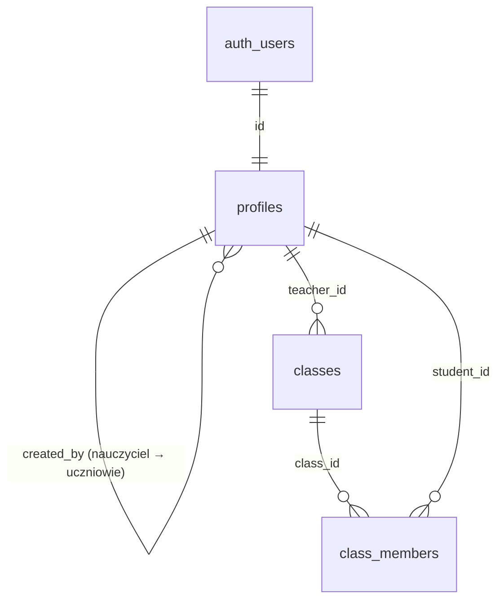

# Baza danych — Milestone 3

PostgreSQL w Supabase. Schemat tworzą migracje w `supabase/migrations/`, a dane deweloperskie pochodzą z `supabase/seed.sql`. Tabele lekcji, ćwiczeń, `student_work` i `execution_events` powstaną w Milestone 4–6.

## Tabele



### `profiles`

Jeden wiersz na konto z rolą w klasie. Tworzy go wyzwalacz `on_auth_user_created` na `auth.users` na podstawie `app_metadata`, które może ustawić tylko klucz serwisowy: Edge Function, seed lub `pnpm teacher:create`.

| Kolumna | Opis |
| --- | --- |
| `id` | = `auth.users.id`, usuwane kaskadowo z kontem |
| `role` | `teacher` lub `student` (enum `user_role`) |
| `display_name` | 1–60 znaków, bez spacji na brzegach |
| `username` | tylko uczniowie: `^[a-z0-9][a-z0-9_-]{1,28}[a-z0-9]$`, unikalna w obrębie nauczyciela |
| `created_by` | tylko uczniowie: nauczyciel, który utworzył konto i nim zarządza |
| `created_at`, `updated_at` | `updated_at` ustawia wyzwalacz |

Ograniczenia: uczeń musi mieć `username` i `created_by`, nauczyciel nie ma żadnego z nich. Wyzwalacz `profiles_check` blokuje zmianę `role`, `username` i `created_by` oraz wymaga, żeby `created_by` wskazywał nauczyciela.

### `classes`

| Kolumna | Opis |
| --- | --- |
| `id` | UUID |
| `teacher_id` | domyślnie `auth.uid()` |
| `name` | 1–80 znaków |
| `join_code` | unikalny; domyślnie 8 znaków z alfabetu bez I, O, 0 i 1 (`private.generate_join_code()`) |
| `created_at` | |

### `class_members`

`(class_id, student_id)` jest unikalne. Wyzwalacz `class_members_check` pozwala dodać do klasy tylko ucznia utworzonego przez nauczyciela tej klasy. Bez tego nauczyciel mógłby „przejąć” dostęp do uczniów innego nauczyciela.

## Logowanie ucznia bez e-maila

Supabase Auth wymaga adresu, więc każdy uczeń ma ukryty adres techniczny:

```text
<username>.<teacher_id bez myślników>@students.invalid
```

Tworzy go `private.student_auth_email()` w SQL. To samo robi `studentAuthEmail()` w `supabase/functions/teacher-students/handler.ts`. Wyzwalacz odrzuca konto ucznia z innym adresem, więc obie implementacje nie mogą się rozjechać po cichu. Domena `.invalid` jest zarezerwowana (RFC 2606); żadna poczta na nią nie wychodzi.

Przebieg na `/join`:

1. Przeglądarka wywołuje `public.student_login_email(kod_klasy, nazwa)`, dostępne dla `anon`. Funkcja zwraca adres techniczny ucznia, jeśli należy on do klasy o tym kodzie. W przeciwnym razie zwraca adres, który nie istnieje. Odpowiedź wygląda tak samo, więc nie ujawnia, czy kod klasy lub nazwa istnieją.
2. `signInWithPassword(adres, hasło)` w Supabase Auth sprawdza hasło (bcrypt) i stosuje limit prób.
3. Uczeń nigdy nie widzi adresu technicznego.

Hasła uczniów generuje Edge Function `teacher-students`: 8 znaków `a–z` i `2–9` bez łatwych do pomylenia (około 40 bitów), losowanych przez `crypto.getRandomValues`. Hasło jest pokazywane nauczycielowi raz i nie jest nigdzie zapisywane jawnie. Reset ustawia nowe hasło i wywołuje `public.revoke_user_sessions()`, dostępne tylko dla `service_role`. Funkcja usuwa sesje ucznia razem z tokenami odświeżania. Wydany już token dostępu wygasa po `jwt_expiry` (1 h).

## Row Level Security

RLS jest włączone na wszystkich trzech tabelach. Rola `anon` nie ma do nich żadnych uprawnień. Rola `authenticated` ma tylko wymienione niżej uprawnienia kolumnowe, a polityki zawężają je do wierszy.

| Tabela | Uczeń | Nauczyciel |
| --- | --- | --- |
| `profiles` | odczyt własnego profilu | odczyt własnego profilu i profili utworzonych przez siebie uczniów; brak zapisu z przeglądarki |
| `classes` | odczyt klas, do których należy | odczyt, tworzenie (tylko `name`) i zmiana nazwy własnych klas; właściciela i kodu nie da się wybrać ani zmienić |
| `class_members` | odczyt własnych członkostw | odczyt, dodawanie i usuwanie członków własnych klas (wyzwalacz ogranicza, kogo) |

Funkcje pomocnicze polityk (`private.is_teacher`, `private.owns_class`, `private.is_class_member`) są `security definer`, co zapobiega rekurencji polityk. Leżą w schemacie `private`, którego Data API nie udostępnia.

Konto bez roli w `app_metadata` nie dostaje profilu i nie widzi żadnych danych. Rola w `user_metadata` jest ignorowana, bo użytkownik może ją ustawić sam.

Operacje wymagające klucza serwisowego (tworzenie kont, reset haseł) wykonuje tylko Edge Function `teacher-students`. Sprawdza ona token wywołującego i rolę `teacher` w bazie, a także to, czy klasa lub uczeń należą do tego nauczyciela.

Testy uprawnień: `tests/db/permissions.test.ts` (`pnpm test:db`).
