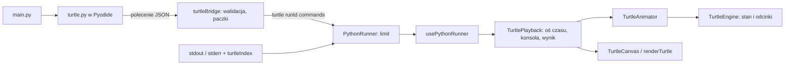

# Turtle — Milestone 2

Edukacyjna warstwa zgodności z `turtle` działająca w przeglądarce. Nie jest to pełna biblioteka standardowa Pythona. Obejmuje podzbiór poleceń z sekcji 12 [specyfikacji](product-spec.md).

## Obsługiwane polecenia

| Polecenie | Działanie | Aliasy |
| --- | --- | --- |
| `forward(distance)` | idź do przodu | `fd` |
| `backward(distance)` | idź do tyłu | `back`, `bk` |
| `left(angle)` | obróć w lewo o kąt w stopniach | `lt` |
| `right(angle)` | obróć w prawo | `rt` |
| `goto(x, y)` | przejdź do punktu; rysuje, jeśli pisak jest opuszczony | |
| `setheading(angle)` | ustaw kierunek: 0 = w prawo, 90 = w górę | `seth` |
| `circle(radius, extent=360)` | okrąg lub łuk, środek `radius` kroków w lewo; ujemny promień — zgodnie z ruchem wskazówek zegara | |
| `penup()` / `pendown()` | podnieś / opuść pisak | `pu`, `up` / `pd`, `down` |
| `color(name)` | kolor pisaka: nazwa koloru CSS (np. `"red"`) albo `"#rrggbb"` / `"#rgb"` | `pencolor` |
| `pensize(width)` | grubość linii | `width` |
| `home()` | wróć do `(0, 0)` i ustaw kierunek 0; rysuje, jeśli pisak jest opuszczony | |
| `clear()` | usuń rysunek, nie przesuwając żółwia | |
| `hideturtle()` / `showturtle()` | ukryj / pokaż żółwia | `ht` / `st` |
| `speed(...)`, `done()`, `mainloop()` | akceptowane dla zgodności, nic nie robią; tempo ustawia suwak | |

W ćwiczeniach typu `python-turtle` funkcje są dostępne bez importu, jak po `from turtle import *`. Działają także `import turtle` z `turtle.forward(100)` oraz `from turtle import forward`.

Błędne argumenty zgłaszają zwykłe wyjątki Pythona z numerem linii w `main.py`: `TypeError` dla wartości niebędącej liczbą, `ValueError` dla nieskończoności lub ujemnej grubości i `TurtleGraphicsError: bad color string` dla nieznanego koloru.

## Współrzędne

- `(0, 0)` to środek; dodatnie x w prawo, dodatnie y w górę.
- Widoczny obszar logiczny ma 400 × 400 kroków: x i y od −200 do 200. Rysunek poza nim jest przycinany.
- Canvas skaluje się do szerokości panelu, ale współrzędne logiczne pozostają te same. Grubość linii jest wyrażona w krokach logicznych, minimum to jeden piksel ekranu.
- Żółw zaczyna w `(0, 0)`, skierowany w prawo, z opuszczonym czarnym pisakiem o grubości 1.
- Kąty są w stopniach, przeciwnie do ruchu wskazówek zegara, normalizowane do zakresu 0–360. Ruchy o wielokrotność 90° są liczone dokładnie, więc kwadrat wraca dokładnie do punktu startu.

## Architektura

- `src/runtime/turtle.py` sprawdza argumenty i od razu przekazuje każde polecenie, np. `{"type": "forward", "distance": 100}`. Wcześniej opróżnia `sys.stdout` i `sys.stderr`, aby tekst wypisany przed poleceniem dotarł do workera przed nim. Moduł nie przechowuje stanu żółwia.
- `execute.py` tworzy nowy moduł `turtle` dla każdego uruchomienia i rejestruje go w `sys.modules`. W ćwiczeniach konsolowych moduł nie jest instalowany.
- `src/runtime/turtleBridge.ts` w workerze parsuje polecenia, odbudowuje je pole po polu i pomija niepoprawne. `TurtleBatcher` łączy je w paczki co 500 poleceń lub około 40 ms. Worker liczy przekazane polecenia. Każdy fragment wyjścia dostaje `turtleIndex`, czyli liczbę poleceń wydanych przed nim. Przed policzeniem nowego polecenia bufor wyjścia jest opróżniany, więc wszystkie fragmenty w jednej wiadomości mają ten sam indeks.
- `PythonRunner` przekazuje polecenia tylko bieżącego `runId` i egzekwuje łączny limit 50 000 poleceń. Moduł Pythona ma ten sam limit, ale zabezpieczenie po stronie głównego wątku działa także wtedy, gdy program go obejdzie.
- `src/turtle/TurtleEngine.ts` to deterministyczna maszyna stanów: `x`, `y`, `heading`, `penDown`, `penColor`, `penWidth`, `visible` oraz lista odcinków i łuków. Nie zależy od Pythona ani od DOM i ma testy jednostkowe.
- `TurtleEngine.cost()` podaje długość polecenia w krokach: ruch to droga, a obrót o 3° to jeden krok. `preview()` pokazuje częściowo wykonane polecenie bez zmiany stanu.
- `src/turtle/TurtleAnimator.ts` odtwarza kolejkę poleceń w czasie przekazywanym z zewnątrz, więc testy są deterministyczne.
- `src/turtle/TurtlePlayback.ts` łączy animację, konsolę i wynik programu. Napędza animację przez `requestAnimationFrame` i ogranicza skok po długiej przerwie do 100 ms.
- `src/turtle/renderTurtle.ts` rysuje odcinki na canvasie w układzie z osią y skierowaną w górę, razem z częściowo narysowanym odcinkiem. Kolejne odcinki o tym samym stylu łączy w jedną ścieżkę.

## Animacja

- Żółw rysuje stopniowo: linie i łuki rosną, obroty są płynne. Zmiany pisaka, koloru i widoczności są natychmiastowe.
- **Tempo** ustawia suwak nad rysunkiem, w skali 1–10, domyślnie 5. Tempo 1 to 40 kroków na sekundę, a każdy poziom jest 1,5 raza szybszy. Przy tempie 10 jest to około 1540 kroków na sekundę. Zmiana działa także w trakcie rysowania. Tempo nie jest zapisywane po odświeżeniu strony.
- **Pomiń animację** od razu pokazuje gotowy rysunek. Polecenia, które przyjdą później w tym samym uruchomieniu, też są rysowane natychmiast.
- **Konsola jest zsynchronizowana z rysunkiem**: tekst wypisany po n-tym poleceniu Turtle pojawia się, gdy żółw skończy to polecenie. Komunikat końcowy, w tym traceback, timeout i informacja o skróceniu wyjścia, pojawia się po zakończeniu animacji.
- W trakcie animacji status brzmi **„Żółw rysuje…”**. Uruchom i przełączanie ćwiczeń są wtedy zablokowane, a Zatrzymaj jest dostępne.
- **Zatrzymaj** przerywa program, jeśli jeszcze działa, kończy animację i czyści ekran żółwia. Tekst, który już był widoczny w konsoli, zostaje. Tekst, do którego żółw jeszcze nie doszedł, nie jest pokazywany. Status: „Program zatrzymany”.
- Rysunek jest czyszczony przy każdym uruchomieniu. Ćwiczenia konsolowe działają bez zmian, bo bez poleceń Turtle wyjście pojawia się od razu.

## Znane ograniczenia

- `speed()` w kodzie jest ignorowane; tempo ustawia wyłącznie suwak.
- Animacja nie przyspiesza automatycznie przy dużych rysunkach. Rysunek z tysiącami poleceń może trwać długo, wtedy warto użyć „Pomiń animację”.
- Program kończy się zwykle szybciej niż animacja. Limit 10 sekund dotyczy wykonania Pythona, a nie animacji.
- Jeden żółw. `Turtle()`, `Screen()`, wiele żółwi, wypełnianie (`begin_fill`, `fillcolor`), tekst (`write`), stemple, zdarzenia klawiatury i myszy oraz `onclick` nie są obsługiwane.
- Brak odczytu stanu z Pythona (`position()`, `heading()`, `xcor()` itd.), ponieważ stan żyje w silniku JavaScript.
- `color()` przyjmuje jedną nazwę. Krotki RGB i dwa argumenty (pisak, wypełnienie) nie są obsługiwane. Nazwy kolorów pochodzą z listy CSS, a nie z Tk.
- `circle()` nie obsługuje parametru `steps`; okręgi są rysowane gładko.
- Limit 50 000 poleceń na uruchomienie. Po jego przekroczeniu program działa dalej, ale kolejne polecenia nie są rysowane, a pod rysunkiem pojawia się komunikat.
- W ćwiczeniu konsolowym `import turtle` kończy się `ModuleNotFoundError`: warstwa nie jest instalowana, a biblioteka standardowa Pyodide nie zawiera `turtle` ani Tk.
